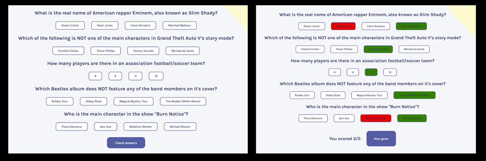

# Quizzical

Application de quiz interactive développée en React. Utilise l'API Open Trivia Database pour générer 5 questions aléatoires avec scoring en temps réel.



## 🎯 Fonctionnalités

- **Questions aléatoires** : Génération de 5 questions de culture générale via l'Open Trivia DB API
- **Mélange des réponses** : Les réponses sont mélangées aléatoirement pour éviter la répétition
- **Sélection interactive** : Interface intuitive pour choisir ses réponses
- **Scoring en temps réel** : Calcul instantané du score final
- **Feedback visuel** : Affichage des bonnes réponses (vert) et mauvaises réponses (rouge)
- **Rejouabilité** : Possibilité de relancer un nouveau quiz

## 🛠️ Technologies

- React
- Vite
- CSS
- Open Trivia DB API
- he (décodage HTML)

## 🚀 Installation
```bash
# Cloner le projet
git clone https://github.com/Kamat99302/quizzical.git

# Installer les dépendances
npm install

# Lancer en développement
npm run dev
```

## 💡 Utilisation

1. Click sur "Start Quiz"
2. Réponds aux 5 questions en sélectionnant une réponse
3. Click sur "Check answers" pour voir ton score
4. Click sur "New game" pour recommencer

## 🎨 Défis techniques

1. **Gestion d'état complexe** : Utilisation de plusieurs `useState` pour gérer l'état du quiz (questions, réponses sélectionnées, score, état de complétion)

2. **Mélange aléatoire des réponses** : Combinaison des bonnes et mauvaises réponses avec mélange via `.sort(() => Math.random() - 0.5)` pour éviter que la bonne réponse soit toujours à la même position

3. **Décodage HTML** : Utilisation de la librairie `he` pour décoder les caractères HTML retournés par l'API (ex: `&quot;` → `"`)

4. **Classes CSS dynamiques** : Application de différentes classes selon l'état du quiz :
   - `selected` : réponse sélectionnée pendant le quiz
   - `correct-answer` : bonne réponse (vert) quand le quiz est terminé
   - `wrong-answer` : mauvaise réponse sélectionnée (rouge)

5. **Validation des réponses** : Vérification que l'utilisateur a répondu à toutes les questions avant d'afficher les résultats

6. **Structure de données** : Utilisation d'un objet `{ 0: "answer1", 1: "answer2" }` pour stocker les réponses sélectionnées, avec l'index de la question comme clé

## 🌐 Démo en ligne

[Voir la démo](https://quizzicalmatt.netlify.app/)

## 📝 License

MIT